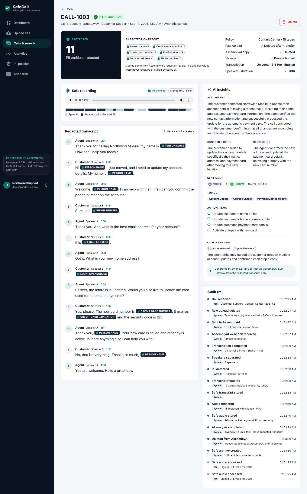
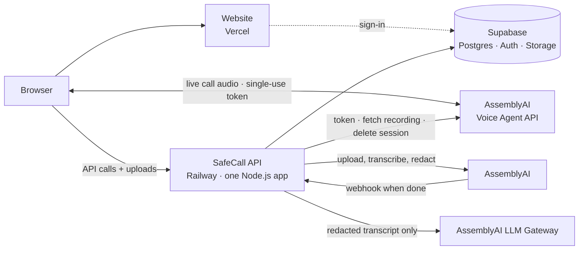
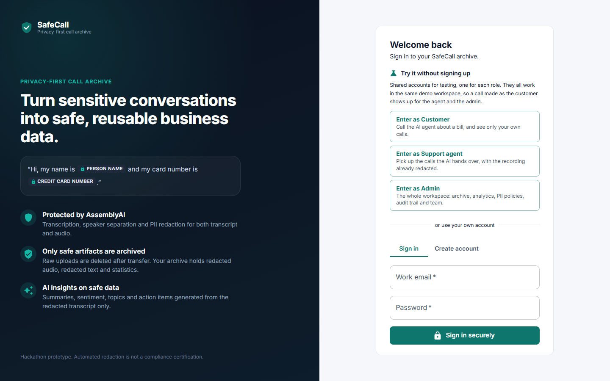
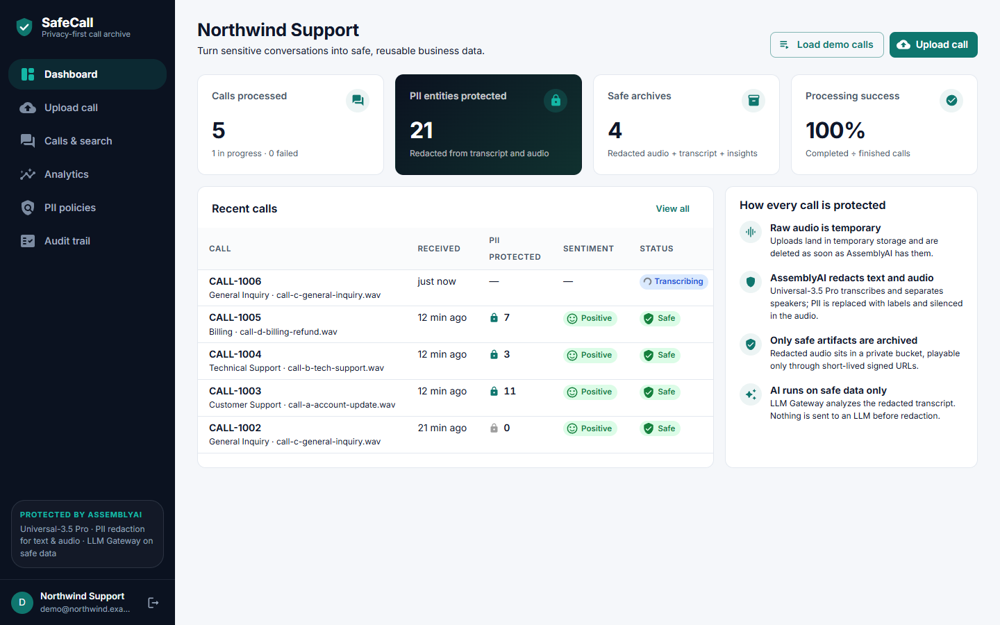
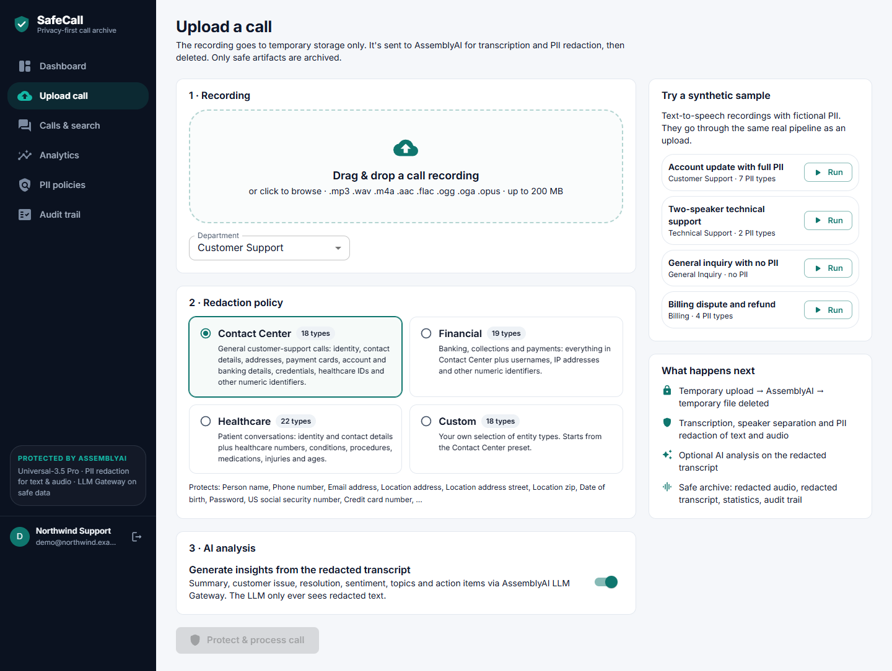
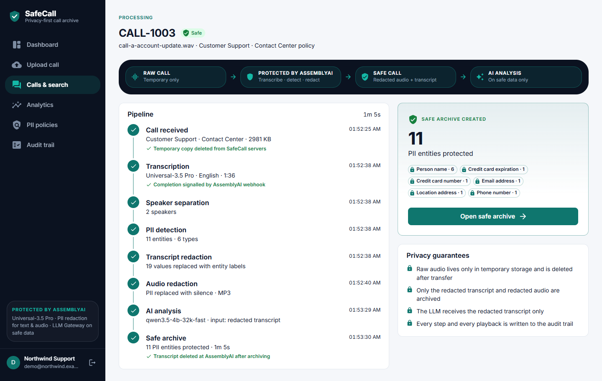
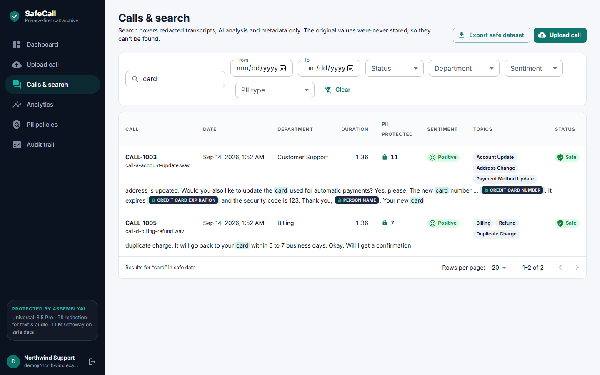
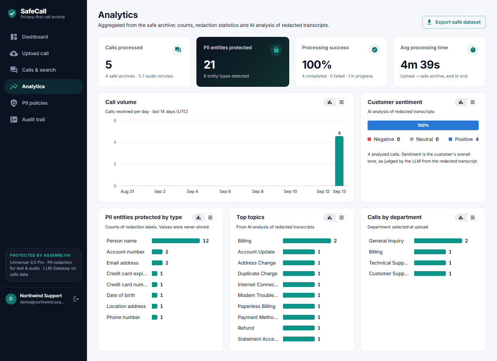
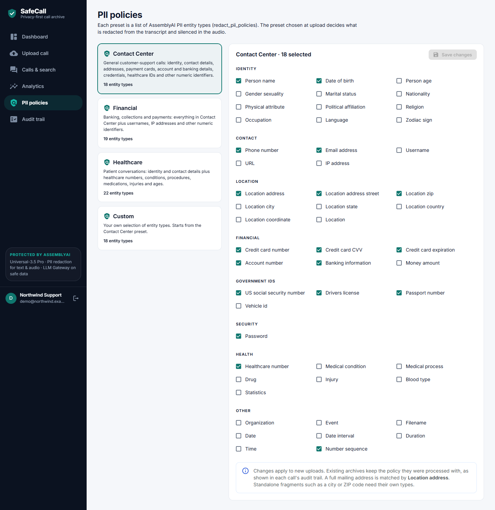
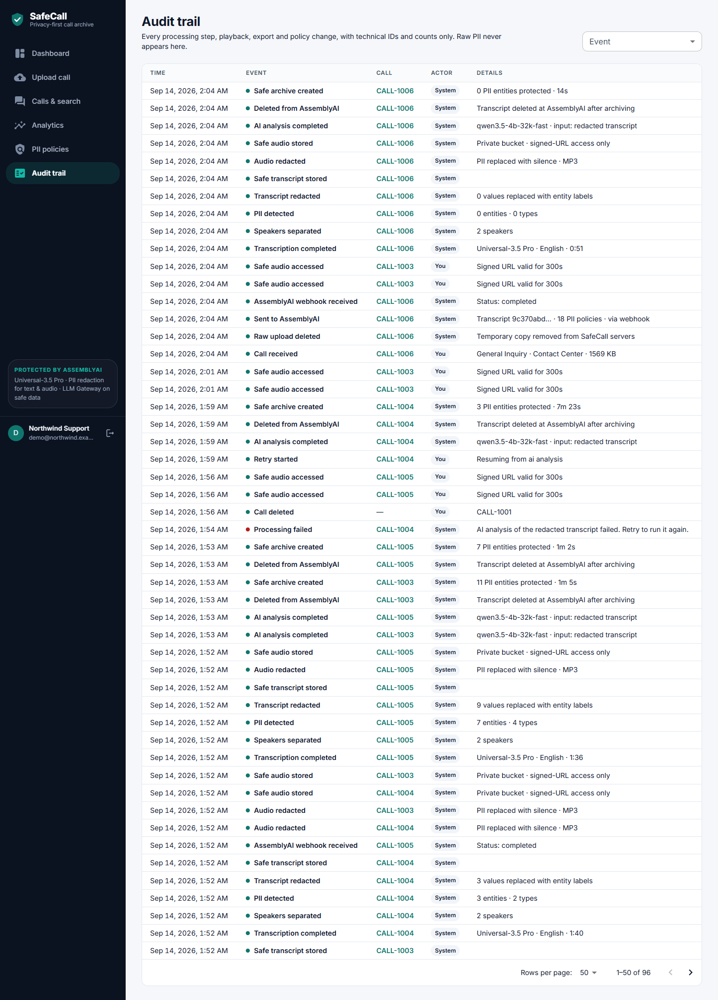

# SafeCall

**Turn sensitive conversations into safe, reusable business data.**

SafeCall is a privacy-first archive for contact-center calls. Calls arrive from a **live AI voice agent** built on AssemblyAI's Voice Agent API, or as uploaded recordings. Every call goes through AssemblyAI for transcription, speaker separation and PII redaction, for both the transcript *and* the audio. Only the safe artifacts are stored: redacted audio, a redacted speaker-labelled transcript, PII statistics, AI insights generated from the redacted text, and a complete audit trail.

Built for the **AssemblyAI Voice Agent Hackathon (lablab.ai, September 2026)**.

> **Disclaimer.** SafeCall is a hackathon prototype demonstrating privacy-oriented call-data processing. Automated PII detection/redaction should not be represented as a universal legal-compliance certification or a substitute for an organization's legal, security, privacy, and governance controls.



---

## Contents

1. [Problem](#problem) · 2. [Solution](#solution) · 3. [Architecture](#architecture) · 4. [Technology stack](#technology-stack) · 5. [AssemblyAI integration](#assemblyai-integration) · 6. [Security model](#security-model) · 7. [Local setup](#local-setup) · 8. [Environment variables](#environment-variables) · 9. [Database setup](#database-setup) · 10. [Deployment](#deployment) · 11. [Demo](#demo) · 12. [Screenshots](#screenshots) · 13. [API](#api-endpoints) · 14. [Tests](#tests) · 15. [Limitations](#limitations) · 16. [Roadmap](#roadmap)

## Problem

Call recordings are some of the most valuable data a support organization has: customer issues, product feedback, agent quality, training material. They are also full of names, phone numbers, addresses, card numbers and account details. So they get locked away, deleted, or copied into analytics and AI tools with the sensitive details still inside. AI voice agents make this worse: every call they take is recorded, and those recordings hold the same details.

## Solution

SafeCall moves the privacy boundary to the front of the pipeline:

```
LIVE AGENT CALL ──┐
(Voice Agent API) │
                  ├──→  PROTECTED BY ASSEMBLYAI  ──→  SAFE CALL  ──→  AI ANALYSIS
UPLOADED CALL ────┘     transcribe · diarize ·        redacted audio   LLM sees redacted
                        detect · redact text+audio    + transcript     text only
```

- **Call the live agent.** Talk to Sam, the AI billing agent of Northwind Mobile (a fictional carrier), built on AssemblyAI's **Voice Agent API**: real-time speech in and out, natural turn-taking, and tool calls for account lookup, recent charges, refunds and contact updates. When you hang up, the call's recording goes through the same redaction pipeline as an upload.
- **Upload** a recording, or run one of four synthetic demo calls.
- **AssemblyAI** (Universal-3.5 Pro, falling back to Universal-2) transcribes it, separates speakers, detects PII against the chosen policy, redacts the transcript and produces a redacted audio file with the PII silenced.
- The **raw recording is deleted** as soon as AssemblyAI's transcription has it: the upload's temporary file, or the live call's session at AssemblyAI. After archiving, the transcript is **deleted at AssemblyAI** too.
- The **safe archive** stores redacted audio in a private bucket, the redacted transcript and utterances, PII counts per entity type, and an audit record of every step.
- **AI analysis** via AssemblyAI LLM Gateway runs *only* on the redacted transcript. It produces a summary, customer issue, resolution, sentiment, topics, action items, speaker roles and a QA note.
- **Search, analytics, a PII protection report, safe-audio playback via signed URLs, and safe dataset export** (JSONL/CSV) make the data reusable.

## Architecture

Three hosted pieces, each with one job:

| Piece | Hosted on | Job |
| --- | --- | --- |
| **Website** (React) | Vercel | The dashboard people sign in to, including live agent calls |
| **API** (one Node.js app) | Railway | Everything server-side: sign-in checks, single-use voice agent tokens, uploads, AssemblyAI calls and its webhook, background processing, search, export |
| **Database, logins, file storage** | Supabase | The safe archive, user accounts, and the private bucket for redacted audio |

Plus the AssemblyAI cloud services: the Voice Agent API (live calls), speech-to-text with PII redaction, and the LLM Gateway.



**Why the API isn't on Vercel.** Call recordings are bigger than Vercel functions accept (4.5 MB per request), and each call keeps processing for minutes after the upload. Railway runs an ordinary always-on server, which suits both.

**No Redis, no separate worker, no Docker.** Background work runs inside the API process. The database is the source of truth, so a restart simply resumes unfinished calls. The details, data flow and idempotency rules are in [docs/architecture.md](docs/architecture.md).

```
safecall/
├── frontend/            React + Vite + MUI app (pages, components, layouts, services, hooks)
│   └── src/voice/       Voice Agent WebSocket + audio client, Northwind mock tools
├── backend/
│   ├── src/
│   │   ├── routes/      REST API, /api/voice-agent, /webhooks/assemblyai
│   │   ├── middleware/  auth, upload, errors
│   │   ├── services/    assemblyai/ (speech-to-text, Voice Agent, live agent) · llm/ · storage/ · audit · pii · analytics · export
│   │   ├── pipeline/    intake (recording → AssemblyAI), processCall (after the webhook), voiceSession (live call → intake), sweep
│   │   ├── queue/       in-process background runner (retries, dedupe)
│   │   ├── db/          repository interfaces + Supabase implementations
│   │   └── app.ts       Express app factory
│   ├── samples/         synthetic demo recordings + generator script
│   └── tests/           Vitest suite (AssemblyAI mocked)
├── database/migrations/ SQL schema
├── examples/            the same live agent as one runnable Python script
└── docs/                architecture + screenshots
```

## Technology stack

| Layer | Choice |
| --- | --- |
| Website | React 19, Vite 8, Material UI 9, React Router 7, TypeScript, Web Audio (AudioWorklet) — hosted on Vercel |
| API | Node.js 22, Express 5, TypeScript, Multer, zod, pino — hosted on Railway |
| Voice AI | AssemblyAI **Voice Agent API** (live agent), official `assemblyai` Node SDK 4.41 (pre-recorded STT, PII redaction, redacted audio), LLM Gateway |
| Database / logins / storage | Supabase Postgres (full-text search), Supabase Auth, Supabase Storage (private bucket) |
| Tests | Vitest + Supertest |

## AssemblyAI integration

All parameters were checked against the live docs ([agent instructions](https://www.assemblyai.com/docs/agent-instructions.md), [llms.txt](https://www.assemblyai.com/docs/llms.txt), [PII redaction](https://www.assemblyai.com/docs/guardrails/redact-pii-from-transcripts), [Voice Agent API](https://www.assemblyai.com/docs/voice-agents/voice-agent-api)) and the SDK typings on 2026-09-14 and 2026-09-15.

**Transcription request** (`backend/src/services/assemblyai/transcription.ts`):

| Parameter | Value | Why |
| --- | --- | --- |
| `speech_models` | `["universal-3-5-pro", "universal-2"]` | Best model with a fallback |
| `speaker_labels` | `true` | Agent/customer separation |
| `language_detection` | `true` | Multilingual recordings |
| `redact_pii` | `true` | Transcript redaction |
| `redact_pii_policies` | Preset list (Contact Center / Financial / Healthcare / Custom) | Only documented policy names are used |
| `redact_pii_sub` | `entity_name` | `[PHONE_NUMBER]`-style labels that can be counted |
| `redact_pii_audio` | `true` | Redacted audio file |
| `redact_pii_audio_quality` | `mp3` (or `wav`) | `REDACTED_AUDIO_FORMAT` |
| `redact_pii_audio_options.override_audio_redaction_method` | `silence` | PII silenced instead of beeped |
| `webhook_url` + `webhook_auth_header_name/value` | `…/webhooks/assemblyai?call_id=…` + shared secret | No long polling; authenticated deliveries |
| `redact_pii_return_unredacted` | **never set** | The unredacted transcript is never requested |

- **Upload.** `client.files.upload(tempPath)` sends the file, then the temp file is deleted.
- **Webhook.** The handler authenticates the header, schedules the work and returns 200 at once. The API then fetches the transcript with `client.transcripts.get`, the redacted audio with `client.transcripts.redactedAudio` (the URL is valid for 24 h, so it is copied into private storage straight away), and finally calls `client.transcripts.delete`.
- **LLM Gateway.** Calls `https://llm-gateway.assemblyai.com/v1/chat/completions` with the prompt rules from the spec, `post_processing_steps: json-repair`, and zod validation.
  - Models that support `response_format` get a strict JSON Schema.
  - Models without it get the same schema in the prompt. `LLM_RESPONSE_FORMAT=auto` checks the gateway's `/v1/models`.
- **No deprecated parameters.** `summarization`, `auto_chapters` and LeMUR are not used.

**Voice Agent API** (`backend/src/services/assemblyai/voiceAgent.ts` and `liveAgent.ts`, `frontend/src/voice/`):

| Piece | How SafeCall uses it |
| --- | --- |
| `GET /v1/token` | The API mints a single-use token (`expires_in_seconds=120`, `max_session_duration_seconds=600`). The browser never sees the API key. |
| `wss://agents.assemblyai.com/v1/ws?token=…` | The browser streams microphone audio as PCM16 mono 24 kHz (`input.audio`) and plays `reply.audio`. |
| `session.update` | Inline agent: system prompt, greeting, voice `alba`, `language_codes: ["en"]`, keyterms, turn detection (`min_silence` 1400 ms, `max_silence` 4000 ms, barge-in on) and four JSON-Schema function tools. |
| `tool.call` → `tool.result` | Tools run in the browser against mock Northwind data. Results go back when `reply.done` is the latest event. |
| `reply.done` with `interrupted` | Queued agent audio is flushed when the caller barges in. |
| `session.end` | Sent before the socket closes, so the 30-second resume window isn't billed. |
| `GET /v1/sessions/{id}` | After the call, the API checks the organization reference in the session's system prompt and waits for the stereo OGG recording. |
| `DELETE /v1/sessions/{id}` | Once the transcription job has the audio, the session (unredacted recording and timeline) is deleted. |

## Security model

- **Raw audio is transient.** Multer streams uploads to the OS temp directory. The file is deleted immediately after it reaches AssemblyAI (`RAW_UPLOAD_DELETED`), and a periodic purge removes anything left by a crash.
- **Only redacted data is archived.** The API refuses transcripts without `redact_pii`, copies only safe fields, and never reads `unredacted_*`.
- **The LLM sees redacted text only.** `analyze()` accepts a branded `SafeText` type, so raw text can't be passed by accident. Its input is rebuilt from the archived redacted utterances.
- **Live agent calls.**
  - The browser talks to AssemblyAI with a single-use token, so the API key stays on the API and SafeCall's servers never receive live audio.
  - No live transcript is shown, because it would be unredacted. The page shows the call state and the agent's actions only.
  - Tool calls run against mock data in the browser.
  - Only the organization that started a call can archive it: an HMAC reference in the session's system prompt is checked when archiving.
  - After archiving, the AssemblyAI session is deleted (`VOICE_SESSION_DELETED`).
- **Tenant isolation.**
  - Every API query is scoped to the caller's organization from the Supabase JWT.
  - Tables have RLS enabled with no policies for the browser roles, so the browser can't read them directly.
  - The Supabase secret key exists only on the API.
- **Private storage.** The `safe-call-audio` bucket is private (the API forces it private at startup). Playback uses 5-minute signed URLs, and every issuance is audited (`SAFE_AUDIO_ACCESSED`).
- **Webhooks** are authenticated with a shared header secret (constant-time comparison) and deduplicated per call.
- **Audit metadata is sanitized.** Content-bearing keys are dropped, so audit entries hold IDs, stages and counts only.
- **Logs** never include transcript text, audio URLs or credentials. pino redacts those fields as a safety net.
- **Safe errors.** Users see readable messages; stack traces and internals are only logged.
- **CSV export** neutralizes spreadsheet formulas.

## Local setup

Prerequisites: **Node.js 22+** (the Supabase client needs Node's built-in WebSocket), a **Supabase project** (the free plan is fine) and an **AssemblyAI API key**. No Docker is needed. Local development uses your real Supabase project.

```powershell
git clone https://github.com/Chong1120/Endpointing.git safecall
cd safecall
npm install; npm run install:all           # root tools + backend + frontend

Copy-Item backend\.env.example backend\.env     # AssemblyAI key, webhook secret, Supabase URL + secret key
Copy-Item frontend\.env.example frontend\.env   # Supabase URL + publishable key

npm run db:migrate    # needs DATABASE_URL in backend/.env (Supabase → Connect → Session pooler)
npm run dev           # API on http://localhost:4000, website on http://localhost:5173
```

Generate the webhook secret with `node -e "console.log(require('crypto').randomBytes(32).toString('hex'))"`.

**Webhooks in local development.** AssemblyAI must be able to reach the API over HTTPS. Without a public URL, the API checks each transcript's status on a timer instead, so everything still works. To test the real webhook path, run a tunnel and restart the API:

```powershell
npx cloudflared tunnel --url http://localhost:4000   # prints https://<random>.trycloudflare.com
# backend/.env → PUBLIC_API_URL=https://<random>.trycloudflare.com
```

The live agent works locally too: `localhost` counts as a secure origin, so the browser allows the microphone.

The synthetic demo recordings are committed in `backend/samples/`. To regenerate them with Windows' built-in voices, run `npm run samples:generate`.

## Environment variables

See [.env.example](.env.example) for the annotated list.

| Variable | Where | Purpose |
| --- | --- | --- |
| `ASSEMBLYAI_API_KEY` | API | AssemblyAI key (server-side only) |
| `ASSEMBLYAI_WEBHOOK_SECRET` | API | Shared secret echoed in `X-SafeCall-Webhook-Secret`; also signs live agent session references |
| `ASSEMBLYAI_DELETE_AFTER_ARCHIVE` | API | Delete the transcript at AssemblyAI after archiving (default `true`) |
| `REDACTED_AUDIO_FORMAT` | API | `mp3` (default) or `wav` |
| `SUPABASE_URL`, `SUPABASE_SERVICE_ROLE_KEY` | API | Project URL and the Supabase **secret** key (`sb_secret_…`, or the legacy `service_role` key) |
| `SUPABASE_AUDIO_BUCKET` | API | Private bucket name (default `safe-call-audio`) |
| `DATABASE_URL` | Your laptop, migrations only | Postgres connection string (Session pooler) |
| `PUBLIC_API_URL` | API | Public HTTPS base URL used for the AssemblyAI webhook |
| `LLM_MODEL`, `LLM_FALLBACK_MODEL`, `LLM_RESPONSE_FORMAT` | API | LLM Gateway model settings |
| `CORS_ORIGINS` | API | Allowed browser origins (wildcards such as `https://*.vercel.app` are supported) |
| `MAX_UPLOAD_MB`, `SIGNED_URL_TTL_SECONDS` | API | Upload limit (default 200 MB), signed URL lifetime (default 300 s) |
| `VITE_API_URL`, `VITE_SUPABASE_URL`, `VITE_SUPABASE_ANON_KEY` | Website | Public build-time values; the last one is the Supabase **publishable** key |

The live agent needs no extra variables.

## Database setup

Schema: [database/migrations/0001_init.sql](database/migrations/0001_init.sql).

- **Tables:** `organizations`, `users`, `calls`, `call_utterances`, `audit_logs`, `pii_policy_settings`.
- **JSONB columns:** `pii_counts`, `ai_summary` and audit `metadata`.
- **Indexes:** organization, status, `created_at`, department, sentiment, and GIN indexes on the search vector, PII types and topics.
- **Search:** a stored full-text search vector over safe data only, queried through the `search_calls()` function.
- **Setup helper:** `ensure_user_profile()` creates an organization and profile on first sign-in.
- **Storage:** the private `safe-call-audio` bucket.

```powershell
$env:DATABASE_URL = "postgresql://postgres.<ref>:<password>@<pooler-host>:5432/postgres"
npm run db:migrate    # tracks applied files in schema_migrations
Remove-Item Env:DATABASE_URL
```

Copy the **Session pooler** string from **Connect** in the Supabase dashboard and percent-encode any symbols in the password. Alternatively, paste the SQL file into the SQL editor.

## Deployment

**1. Supabase.**
1. Run the migration (see above).
2. In *Authentication → Sign In / Providers → Email*, turn off "Confirm email" for a demo, or configure SMTP.
3. Copy the Project URL, the publishable key and the secret key.

**2. Railway (the API): one service, nothing else.**
1. Create a project from this GitHub repo.
2. In the service settings, set **Root Directory** to `/backend`, **Healthcheck Path** to `/health` and **Watch Paths** to `/backend/**`, and keep **Serverless** off. Leave the build and start commands empty: Railway runs `npm ci`, `npm run build` and `npm start` from `backend/package.json`. `backend/railway.json` holds the same settings for services that can still use Railway's deprecated config-as-code.
3. **Variables:**
   ```
   NODE_ENV=production
   ASSEMBLYAI_API_KEY=…
   ASSEMBLYAI_WEBHOOK_SECRET=…
   SUPABASE_URL=https://<ref>.supabase.co
   SUPABASE_SERVICE_ROLE_KEY=<Supabase secret key>
   LLM_MODEL=claude-opus-5
   LLM_FALLBACK_MODEL=qwen3.5-4b-32k-fast
   CORS_ORIGINS=https://<your-app>.vercel.app
   PUBLIC_API_URL=https://<api-domain>
   ```
4. Use **Networking → Generate Domain** to get the API address, and put it in `PUBLIC_API_URL`.
5. Keep it at **one instance**, because background work runs inside this process.

**3. Vercel (the website).**
1. Import the repo with root directory `frontend`. The framework is detected as Vite, and `vercel.json` handles SPA rewrites and security headers. Its `Permissions-Policy` allows the microphone on the site itself, for the live agent.
2. Set `VITE_API_URL=https://<api-domain>`, `VITE_SUPABASE_URL` and `VITE_SUPABASE_ANON_KEY` (the publishable key).

**4. Wire it together.**
1. On Railway, set `CORS_ORIGINS` to the Vercel address.
2. In Supabase, go to *Authentication → URL Configuration* and set the Site URL to the Vercel address.

Uploads go straight from the browser to the Railway API. They never pass through Vercel functions, which cap request bodies at 4.5 MB.

**AssemblyAI account settings (recommended).** Opt out of the model-improvement program. Set a short time-to-live on the *Data Controls* page as a backstop to SafeCall's own deletion.

## Demo

1. Sign up at `/login` (the organization name you enter becomes your isolated workspace).
2. **Live agent.** Click **Call the live agent** on the dashboard, then **Start call**, and allow the microphone.
   - Tell Sam you were charged twice, give the made-up number 415 555 0142 and ask for the refund.
   - Optionally, change your email to `jane.doe@example.com`.
   - The tool calls appear under *What Sam did*.
   - **End call** opens the call's Processing page. Its safe archive has your made-up details silenced in the audio and replaced with labels in the transcript.
3. **Dashboard → Load demo calls.** This runs four synthetic recordings through the *real* pipeline (real AssemblyAI calls):
   | Sample | Shows |
   | --- | --- |
   | Account update (Customer Support) | Name, phone, email, address, card number and expiry are redacted. The spoken CVV is **not** caught (see [Limitations](#limitations)) |
   | Tech support (Technical Support) | Two speakers, many turns, an account number |
   | General inquiry | No PII — nothing is over-redacted |
   | Billing dispute (Billing, Financial policy) | Name, date of birth, account number, email, refund discussion |
4. Open a call while it processes. The **Processing** page shows each real stage as the backend records it, with no simulated progress.
5. Open the **safe archive**:
   - the PII protection report;
   - a **safe recording** you can play, with a timeline marking the redacted segments (click a transcript timestamp to jump there);
   - the redacted transcript with agent/customer roles;
   - AI insights;
   - the audit trail.
6. **Calls & search.** Search for "refund" or "card" and filter by PII type, sentiment, department or date. Then use **Export safe dataset** (JSONL or CSV).
7. **Analytics**, **PII policies** (edit a preset) and **Audit trail** (every step, playback and export).

All sample data is synthetic: 555-01xx phone numbers, `example.com` emails, and the standard `4111…` test card.

## Screenshots

| | |
| --- | --- |
|  Login |  Dashboard |
|  Upload |  Processing |
|  Safe archive |  Search |
|  Analytics |  Policies |
|  Audit trail | |

To regenerate them against a running instance: `cd frontend; $env:SAFECALL_EMAIL="…"; $env:SAFECALL_PASSWORD="…"; node scripts/screenshots.mjs` (uses the installed Microsoft Edge).

## API endpoints

All `/api/*` endpoints need `Authorization: Bearer <Supabase access token>` and are scoped to the caller's organization.

| Method | Path | Description |
| --- | --- | --- |
| `POST` | `/api/voice-agent/session` | Single-use Voice Agent token plus the live agent's session config |
| `POST` | `/api/voice-agent/sessions/:id/archive` | Fetch a finished live call's recording, run it through redaction, delete the AssemblyAI session → 202 |
| `POST` | `/api/calls` | Upload a recording (multipart: `file`, `department`, `policy_preset`, `analysis_enabled`) → 202 |
| `GET` | `/api/calls` | List calls (`status`, `department`, `sentiment`, `pii_type`, `from`, `to`, `page`, `page_size`) |
| `GET` | `/api/calls/:id` | Safe archive: call, redacted utterances, audit events |
| `GET` | `/api/calls/:id/audio-url` | Short-lived signed URL for the redacted audio (audited) |
| `GET` | `/api/calls/:id/audit` | Audit trail for one call |
| `POST` | `/api/calls/:id/retry` | Resume a failed call from the failed stage |
| `DELETE` | `/api/calls/:id` | Delete a call and its safe audio (admin) |
| `GET` | `/api/search` | Full-text search over safe data (`q` + the list filters), with highlighted snippets |
| `GET` | `/api/analytics` | Totals, PII by type, topics, sentiment, volume, processing time |
| `GET` | `/api/audit` | Organization audit log (`call_id`, `event_type`, paging) |
| `GET` | `/api/export` | Safe dataset export (`format=jsonl\|csv` + filters) |
| `GET` / `PUT` / `DELETE` | `/api/policies[/:preset]` | View, customize or reset PII policy presets |
| `GET` / `POST` | `/api/demo/samples[/:id]` | List or run the synthetic demo recordings |
| `GET` | `/api/me` | Profile, organization, platform settings |
| `POST` | `/webhooks/assemblyai` | AssemblyAI completion webhook (shared-secret header) |
| `GET` | `/health` | Health check |

## Tests

```powershell
npm test            # Vitest: AssemblyAI + LLM Gateway mocked
npm run typecheck   # backend + frontend
```

Coverage includes:
- upload validation and temp-file cleanup;
- authentication and organization isolation;
- PII counting (including grouping of word-level markers);
- webhook authentication and duplicate deliveries;
- failed and successful AssemblyAI processing, and resumable retry;
- the in-process background runner: dedupe, backoff, retry budget, and resuming after a restart;
- storage paths and signed URLs;
- LLM request shape, model fallback and AI JSON validation;
- the live agent: token minting without exposing the API key, the organization check, waiting for the recording, archiving through the redaction pipeline, and deleting the AssemblyAI session;
- audit sanitization, analytics and the export formats;
- an end-to-end test: upload → AssemblyAI job → webhook → background processing → safe archive.

### Verified against real services

The pipeline was run end to end against real AssemblyAI (Universal-3.5 Pro), the LLM Gateway and Supabase with six synthetic calls:

- **Webhooks.** AssemblyAI delivered completion webhooks through a Cloudflare quick tunnel, each recorded as `WEBHOOK_RECEIVED`. The status-check fallback handled runs without a tunnel.
- **Redaction.** Names, phone numbers, emails, addresses, card numbers, expiry dates, dates of birth and account numbers were redacted in both the transcript and the audio (silence). The no-PII call had zero redactions. The one miss, a spoken CVV, is listed under Limitations.
- **Resumable retry.** Real LLM Gateway failures (a 400 for model access, a 429 rate limit) marked calls `FAILED` at the AI stage. Retry then completed them without transcribing again.
- **Upload path.** A multipart upload through `POST /api/calls` left the temp directory empty after intake. The transcript was deleted at AssemblyAI once the archive was complete.
- **Current design** (2026-09-15, after removing Redis and the separate worker):
  - The API ran with a new-style Supabase secret key (`sb_secret_…`), and sign-in used a publishable key (`sb_publishable_…`).
  - A call left mid-pipeline by a simulated crash was resumed automatically when the API started.
  - A fresh call completed end to end through in-process background processing.
- **Live agent** (2026-09-15, real Voice Agent API):
  - A session accepted SafeCall's inline config (voice, four tools, turn detection) and reached `session.ready` in about 1 s, then Sam spoke the greeting.
  - After `session.end`, the stereo OGG recording was available within about 4 s.
  - The organization check matched the reference read back from the session, and rejected another organization.
  - `DELETE /v1/sessions/{id}` removed the session; looking it up afterwards returned 404.
  - A second session's recording went through the archive path: downloaded, uploaded with SafeCall's exact redaction request, and transcribed (even the agent's own name came back as `[PERSON_NAME]`). The redacted audio was ready, and then both the transcript and the voice session were deleted at AssemblyAI.

## Limitations

- **Automated redaction is not perfect.** In our synthetic test call, AssemblyAI redacted the spoken card number and expiry, but it did **not** redact "the security code is 123". That applied to both the transcript and the audio, and adding `number_sequence` didn't catch it either. SafeCall shows exactly what was redacted and never claims completeness. Review policies against your own recordings and keep a human in the loop for high-risk data.
- **The live agent hears the live call.** Like any voice agent, AssemblyAI processes the unredacted conversation while the call is happening. SafeCall's guarantee covers what is stored and reused afterwards, and the session is deleted once it is archived.
- **Live agent calls need a browser with a microphone.** They are built for Chrome and Edge. Firefox and Safari use a resampling path that hasn't been tested yet. Calls are capped at 10 minutes.
- **Closing the tab mid-call** relies on a `keepalive` request to archive the call. If that request never arrives, the session stays at AssemblyAI until it is deleted, so keep AssemblyAI's data retention short.
- **PII counts are derived from redaction labels.** AssemblyAI redacts word by word, so SafeCall groups adjacent same-type labels into one entity. Two same-type entities separated only by a comma may be counted as one.
- **LLM model access depends on your AssemblyAI account.** LLM Gateway isn't covered by AssemblyAI's free credits, and on the account used for development only `qwen3.5-4b-32k-fast` was accessible; Claude, GPT and Gemini returned "no access". SafeCall asks for `LLM_MODEL` (default `claude-opus-5`) first. While the account can't use it, `LLM_FALLBACK_MODEL` (default `qwen3.5-4b-32k-fast`) answers and the first model is tried again every hour, so enabling billing upgrades the analysis without a redeploy. The model that produced each analysis is stored with it and in the call's audit trail.
- **Single API instance.** Background work runs inside the API process, and the database lets it resume after restarts. Running several instances would need a shared queue again.
- **Original filenames are stored as metadata.** Avoid putting personal data in filenames.
- **One organization per sign-up.** There are no invitations or SSO yet. Roles exist in the schema, but the UI only uses `admin`.
- **Failed uploads can't be retried without the file.** If transcription fails before the archive exists, the raw file is gone by design, so the user uploads again.
- **Tested mostly on English.** The synthetic calls use English Windows text-to-speech voices.

## Roadmap

- pgvector semantic search over safe transcripts
- Per-organization retention policies and automatic archive expiry
- Team invitations, SSO and role-based permissions in the UI
- Human review queue for low-confidence or high-risk calls
- A shared job queue for running several API instances
- Streaming redaction for live calls (AssemblyAI streaming PII redaction)
- Phone access to the live agent through AssemblyAI's SIP integration (Twilio)
- Custom entity lists via `redact_static_entities` (product names, internal codes)

## License

[MIT](LICENSE)
