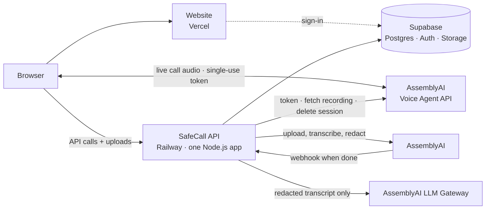
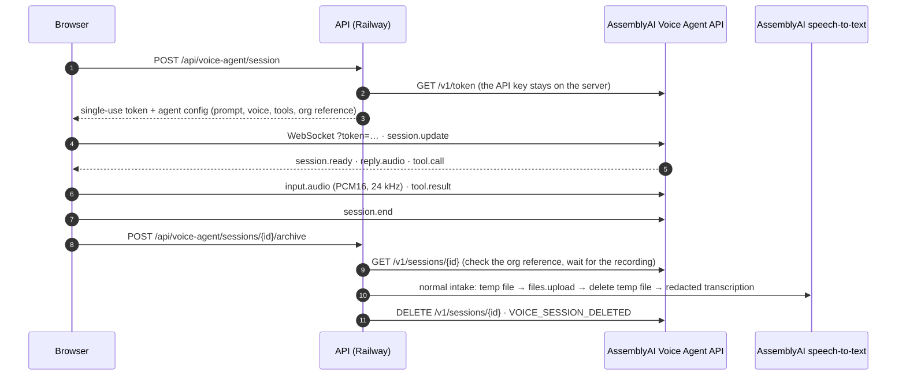
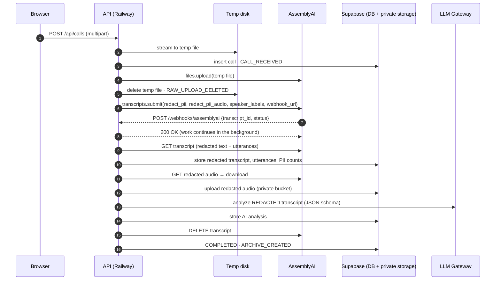

# SafeCall architecture

SafeCall turns recorded customer calls into a **safe archive**: redacted audio, a redacted and speaker-separated transcript, PII statistics, AI insights computed from the redacted text, and an audit trail. The original recording never reaches permanent storage.

## Three pieces, one job each

| Piece | Hosted on | Responsibility |
| --- | --- | --- |
| **Website** (`frontend/`) | Vercel | Two applications behind one sign-in, chosen by role: the customer's phone line, and the staff console (upload, live processing view, safe archive, search, analytics, policies, audit, team). It talks to the API, and during a live call to AssemblyAI's Voice Agent WebSocket; never to tables or storage directly. |
| **API** (`backend/`) | Railway | The only server. Checks sign-ins and scopes everything to the caller's organization. Receives uploads, calls AssemblyAI, receives the webhook, runs the background pipeline, issues signed audio URLs, and serves search, analytics and export. |
| **Database, logins, storage** (`database/migrations/`) | Supabase | Postgres tables (`organizations`, `users`, `calls`, `call_utterances`, `audit_logs`, `pii_policy_settings`), full-text search over safe data, Supabase Auth, and the private `safe-call-audio` bucket. RLS is enabled with no anon/auth policies. |

**Why the API isn't on Vercel too.** Call recordings exceed the 4.5 MB request limit of Vercel functions, and a call keeps processing for minutes after the upload (waiting on AssemblyAI, fetching redacted audio, calling the LLM). Railway runs an ordinary always-on Node server, which suits both.

## Background work without a queue service

AssemblyAI expects its webhook to be answered within 10 seconds, so the webhook handler only authenticates the request, schedules the work and returns 200. The work runs in the same Node process (`backend/src/queue/backgroundQueue.ts`):

- **Duplicates.** A duplicate webhook for a call that is already running is ignored, and a finished call is never processed twice (the database status is checked before starting).
- **Retries.** Transient failures (network, 429 rate limits, 5xx, redacted audio not ready yet, invalid LLM JSON) retry with exponential backoff starting at 10 s, about 5 minutes in total. After that the call is marked `FAILED`, and **Retry** in the UI resumes it from the failed stage.
- **Restarts.** The database is the source of truth. Every pipeline stage is idempotent, and a sweep that runs at start-up and every 2 minutes (`sweepCalls`) handles two cases. Calls left mid-pipeline by a deploy or crash are resumed. Calls waiting on AssemblyAI longer than usual get a status check, which catches missed webhooks.
- **Local development.** Without a public HTTPS URL, submissions omit `webhook_url` and the API checks the transcript status on a timer instead.

This design assumes **one API instance**. To scale horizontally, reintroduce a shared queue (for example Redis + BullMQ) behind the same `JobQueue` interface.

## Live agent (Voice Agent API)

A customer — and an admin trying the product — can call "Sam", a billing agent for the fictional Northwind Mobile, built on AssemblyAI's Voice Agent API. The conversation is live and two-way; SafeCall only acts before and after it.

- **Keys.** The browser gets a single-use token that must be redeemed within 2 minutes and caps the call at 10 minutes. The AssemblyAI API key never leaves the API.
- **No live audio or transcript through SafeCall.** Audio flows between the browser and AssemblyAI. The page shows the call state and the agent's actions only; live transcript events are ignored because they are unredacted.
- **Tools run in the browser** against mock Northwind data (`frontend/src/voice/northwindTools.ts`), so what a caller tells a tool never reaches the API.
- **Keeping the agent talking.** Two things used to leave a caller listening to silence, both found by driving a real session and logging every event. A tool result was held back whenever anything at all arrived after `reply.done` — a cough raises `input.speech.started` — so the gate is now "no reply is being generated" instead. And the prompt used to invite a filler line ("say something short like 'One moment' while it runs"), which the model took as permission to end its turn; it now has to finish the job, chaining the account lookup into the charge list before it speaks. As a backstop, if the agent owes an answer — the caller has stopped talking, or a tool result has gone out — and says nothing for seven seconds, the client sends `reply.create` to ask it to carry on, at most twice per turn. It does **not** do this when the agent has spoken since: an agent waiting on an answer to its own question, prodded, will invent the caller's reply and act on it.
- **Handover to a person.** The `transfer_to_human` tool takes a reason and nothing else — no free text — so nothing the caller said can ride along. The browser passes the reason to the archive request, which records `FOLLOW_UP_REQUESTED`. The Escalations queue is derived from the audit trail: a call is open while it has a `FOLLOW_UP_REQUESTED` with no matching `FOLLOW_UP_RESOLVED`, so the handover needs no extra table and no extra state.
- **Ownership without state.** The system prompt carries an HMAC of the organization id, keyed with the webhook secret. When archiving, the API reads the prompt back from AssemblyAI and checks it, so an organization can only archive its own calls, even across restarts.
- **Same pipeline as uploads.** The stereo OGG recording (caller on the left, agent on the right) is archived like any upload: department `AI Voice Agent`, Contact Center policy, AI analysis on. Nothing in the live path bypasses redaction.
- **AssemblyAI's copy is deleted.** The voice session holds an unredacted recording and conversation timeline, so it is deleted as soon as the transcription job has the audio. If the caller closes the tab mid-call, the page still sends the archive request with `fetch(…, { keepalive: true })`.
- **Browser audio.** Capture runs at the device rate and an AudioWorklet resamples to 24 kHz, because a forced 24 kHz context loses echo cancellation in Firefox and is ignored by Safari. Echo cancellation is on and browser noise suppression is off, as AssemblyAI recommends.

## Data flow and the privacy boundary

Everything left of the AssemblyAI step is transient. After it, only redacted artifacts exist:

| Artifact | Where | Contains PII? |
| --- | --- | --- |
| Raw upload | OS temp dir on the API host, deleted right after `files.upload` (plus a periodic purge of stale files) | Yes — transient only |
| AssemblyAI transcript | AssemblyAI, deleted after archiving (`ASSEMBLYAI_DELETE_AFTER_ARCHIVE`) | Redacted text only (`redact_pii_return_unredacted` is never requested) |
| Redacted audio | Supabase Storage, private bucket | PII replaced with silence |
| Redacted transcript + utterances | Postgres | Entity labels such as `[PHONE_NUMBER]` |
| PII statistics | Postgres (`pii_counts`, `pii_types`, `pii_total`) | Types and counts only |
| AI analysis | Postgres (`ai_summary`) | Generated from redacted text |
| Audit trail | Postgres (`audit_logs`) | IDs, stages, counts — metadata is sanitized |

### Safeguards in code

- **Request builder** (`services/assemblyai/transcription.ts`): `redact_pii: true`, `redact_pii_sub: "entity_name"`, `redact_pii_audio: true` with `override_audio_redaction_method: "silence"`, and never `redact_pii_return_unredacted`.
- **Response guard** (`toSafeTranscript`): refuses transcripts where `redact_pii !== true` and copies only safe fields (never `unredacted_*`).
- **Type-level LLM guard**: `AnalysisService.analyze()` accepts only the branded `SafeText` type, which can only be built from a verified redacted transcript or the safe archive.
- **Logs**: pino redaction paths for text, transcript, URL and credential fields; errors are summarized (name/status/message) without payloads.
- **Access**: the Supabase secret key lives only on the API; every query is scoped to the caller's organization; RLS denies the browser roles; playback uses 5-minute signed URLs and each issuance is audited.

## Pipeline stages and idempotency

`processCall` (in `backend/src/pipeline/processCall.ts`) is resumable. Each stage checks whether its output already exists, and each audit event is written once per call:

1. **Transcription + speaker separation.** Language, duration, model, speaker count.
2. **PII.** Count markers, then store the redacted transcript and utterances.
3. **Audio.** Wait for the redacted audio, download it, then upload it to private storage.
4. **AI analysis.** Built from the archived redacted utterances.
5. **Cleanup and finalize.** Delete the transcript at AssemblyAI (best effort), then mark `COMPLETED`.

## PII counting

`redact_pii_sub: "entity_name"` replaces detected values with labels. AssemblyAI redacts **word by word**, so one address can arrive as `[LOCATION_ADDRESS] [LOCATION_ADDRESS], [LOCATION_ADDRESS]`. SafeCall counts a run of same-type markers separated only by spaces, commas or dashes as one entity (`countPiiMarkers`), and the UI renders the run as a single redaction bar.

## LLM analysis

LLM Gateway `POST /v1/chat/completions`, authenticated with the raw API key. The system prompt requires analyzing only the redacted transcript, never reconstructing redacted information, and never inventing facts.

- Models that support `response_format` get a strict JSON Schema.
- Models that don't (for example `qwen3.5-4b-32k-fast` and `claude-opus-5`) get the same schema in the prompt.
- `temperature` is only sent to models that accept it.

`LLM_RESPONSE_FORMAT=auto` checks `GET /v1/models`. Output is repaired server-side (`json-repair`) and validated with zod.

Model choice: `LLM_MODEL` (default `claude-opus-5`) is tried first. If the gateway refuses it for this account (a 4xx such as "does not have access to this LLM Gateway model"), `LLM_FALLBACK_MODEL` (default `qwen3.5-4b-32k-fast`) answers and `LLM_MODEL` is tried again an hour later. The gateway's own `fallbacks` parameter is still sent, but it only covers failures of a model the account can use.

## Search

`calls.search_vector` is a stored generated `tsvector` over the AI analysis, redacted transcript, department and filename, with a GIN index. `search_calls()` adds org-scoped filters and `ts_headline` snippets and is callable only by the service role.

## Roles, workspaces and who sees what

`ensure_user_profile()` gives every new sign-in its own organization, with the person as admin. Teams form by invitation: an admin's code is `HMAC(webhook secret, org id)` plus an expiry, so it verifies without a table — nothing to store, nothing to leak, and rotating the secret revokes every outstanding code. Redeeming one moves the user row into that organization as a support agent; the calls they already uploaded stay behind in their old workspace, which is reported back so the UI can say so.

Permissions live in one table (`backend/src/domain/permissions.ts`), applied by `requirePermission()` on each route. `/api/me` returns the caller's list, and the UI decides what to show from exactly that list, so a screen can never offer something the API will refuse. Profiles are cached for a minute in `ProfileCache`; joining a workspace or changing a role drops the affected entry, so the change applies on the very next request instead of a minute later.

Three permissions do the narrowing that matters. `calls:browse` gates the archive and search and `analytics:read` the analytics, so a support agent can open the calls in their queue without being handed the whole workspace; the same role has no `agent:call`, because an agent phoning the AI agent it takes handovers from would be a strange product. And `calls:read` means "may read calls" while `calls:read:all` means "may read everyone's".

A customer has only the first, which is what makes them safe to let in. `GET /api/calls` filters on `created_by`, and every single-call route (detail, audio URL, audit) reports another person's call as **not found** rather than forbidden — the response should not confirm that it exists. Search, analytics, export and the audit log are closed to them outright, being workspace-wide by nature. They also get a different application: `CustomerLayout` has no console navigation, the list shows their own calls without opening any of them, and finishing a call leaves them on their own page rather than the staff pipeline view.

## The demo workspace

Three accounts — customer, support agent, admin — share one organization named `Northwind Mobile (demo)`, so a call made as the customer appears in the agent's queue and the admin's audit trail. It is built on the first demo sign-in and repaired on every one, which means a visitor who changes a role cannot spoil it for the next.

Passwords are derived with `HMAC(webhook secret, email)` and used only on the server: `POST /api/demo/login` signs in with Supabase's admin API and returns a session, so nothing secret reaches the browser and there is no password to leak from the bundle. Rotating the secret rotates all three. Three things keep a public login from being expensive or destructive: sign-ins are rate limited per IP, a workspace may start at most 50 live calls a day (counted from `VOICE_SESSION_STARTED` audit events), and the demo admin has a **Reset demo** button that clears the calls, restores the three roles and reseeds. Seeding runs the bundled synthetic recordings through the real pipeline — nothing in the demo bypasses redaction.

## Catching what the first pass misses

AssemblyAI's redaction is strong but not complete: a phone number said with a stumble in the middle, or "the security code is one two three", can come back in the clear. Two calls in testing did exactly that, which is why every archived call gets a second look.

`services/redactionCheck.ts` re-scans the redacted transcript with a deliberately conservative set of patterns — CVVs introduced by a phrase, account numbers, national identifiers, emails (including "jane dot doe at example dot com"), phone numbers and card-length digit runs — skipping anything already inside a `[LABEL]` and anything that reads like a date. Finding nothing, which is the usual case, ends it there.

When it does find something, `pipeline/redactionRecheck.ts` sends the stored recording back to AssemblyAI with those exact strings as `redact_static_entities`, which redacts them in the transcript and bleeps them in the audio. The transcript, utterances, audio file, PII counts and AI summary are all replaced with the cleaner result, and `EXTRA_PII_REDACTED` records what was caught — labels and counts, never the values. If the re-transcription cannot run, the text is masked in place instead, so the leak is closed either way.

Counts are merged rather than overwritten (`mergedCounts`). A second pass cannot see what the first one already silenced, so taking its numbers alone would quietly *lower* a call's PII total; the merge keeps the higher of the two per entity type and adds what the recheck found.
