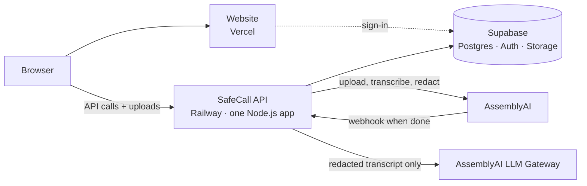
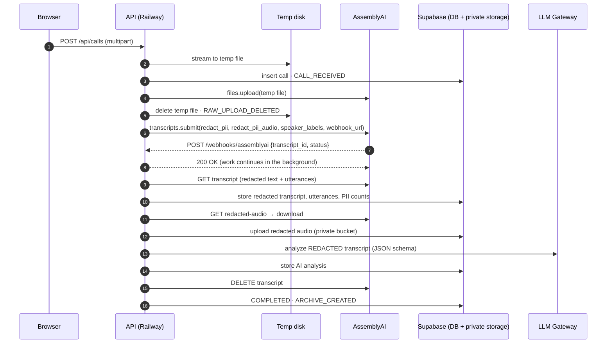

# SafeCall architecture

SafeCall turns recorded customer calls into a **safe archive**: redacted audio, a redacted and speaker-separated transcript, PII statistics, AI insights computed from the redacted text, and an audit trail. The original recording never reaches permanent storage.

## Three pieces, one job each

| Piece | Hosted on | Responsibility |
| --- | --- | --- |
| **Website** (`frontend/`) | Vercel | Sign-in, upload, live processing view, safe archive, search, analytics, policies, audit. It talks only to the API, never to tables or storage directly. |
| **API** (`backend/`) | Railway | The only server. Checks sign-ins and scopes everything to the caller's organization. Receives uploads, calls AssemblyAI, receives the webhook, runs the background pipeline, issues signed audio URLs, and serves search, analytics and export. |
| **Database, logins, storage** (`database/migrations/`) | Supabase | Postgres tables (`organizations`, `users`, `calls`, `call_utterances`, `audit_logs`, `pii_policy_settings`), full-text search over safe data, Supabase Auth, and the private `safe-call-audio` bucket. RLS is enabled with no anon/auth policies. |

**Why the API isn't on Vercel too.** Call recordings exceed the 4.5 MB request limit of Vercel functions, and a call keeps processing for minutes after the upload (waiting on AssemblyAI, fetching redacted audio, calling the LLM). Railway runs an ordinary always-on Node server, which suits both.

## Background work without a queue service

AssemblyAI expects its webhook to be answered within 10 seconds, so the webhook handler only authenticates the request, schedules the work and returns 200. The work runs in the same Node process (`backend/src/queue/backgroundQueue.ts`):

- **Duplicates.** A duplicate webhook for a call that is already running is ignored, and a finished call is never processed twice (the database status is checked before starting).
- **Retries.** Transient failures (network, 429 rate limits, 5xx, redacted audio not ready yet, invalid LLM JSON) retry with exponential backoff starting at 10 s, about 5 minutes in total. After that the call is marked `FAILED`, and **Retry** in the UI resumes it from the failed stage.
- **Restarts.** The database is the source of truth. Every pipeline stage is idempotent, and a sweep that runs at start-up and every 2 minutes (`sweepCalls`) handles two cases. Calls left mid-pipeline by a deploy or crash are resumed. Calls waiting on AssemblyAI longer than usual get a status check, which catches missed webhooks.
- **Local development.** Without a public HTTPS URL, submissions omit `webhook_url` and the API checks the transcript status on a timer instead.

This design assumes **one API instance**. To scale horizontally, reintroduce a shared queue (for example Redis + BullMQ) behind the same `JobQueue` interface.

## Data flow and the privacy boundary

Everything left of the AssemblyAI step is transient. After it, only redacted artifacts exist:

| Artifact | Where | Contains PII? |
| --- | --- | --- |
| Raw upload | OS temp dir on the API host, deleted right after `files.upload` (plus a periodic purge of stale files) | Yes — transient only |
| AssemblyAI transcript | AssemblyAI, deleted after archiving (`ASSEMBLYAI_DELETE_AFTER_ARCHIVE`) | Redacted text only (`redact_pii_return_unredacted` is never requested) |
| Redacted audio | Supabase Storage, private bucket | PII replaced with silence |
| Redacted transcript + utterances | Postgres | Entity labels such as `[PHONE_NUMBER]` |
| PII statistics | Postgres (`pii_counts`, `pii_types`, `pii_total`) | Types and counts only |
| AI analysis | Postgres (`ai_summary`) | Generated from redacted text |
| Audit trail | Postgres (`audit_logs`) | IDs, stages, counts — metadata is sanitized |

### Safeguards in code

- **Request builder** (`services/assemblyai/transcription.ts`): `redact_pii: true`, `redact_pii_sub: "entity_name"`, `redact_pii_audio: true` with `override_audio_redaction_method: "silence"`, and never `redact_pii_return_unredacted`.
- **Response guard** (`toSafeTranscript`): refuses transcripts where `redact_pii !== true` and copies only safe fields (never `unredacted_*`).
- **Type-level LLM guard**: `AnalysisService.analyze()` accepts only the branded `SafeText` type, which can only be built from a verified redacted transcript or the safe archive.
- **Logs**: pino redaction paths for text, transcript, URL and credential fields; errors are summarized (name/status/message) without payloads.
- **Access**: the Supabase secret key lives only on the API; every query is scoped to the caller's organization; RLS denies the browser roles; playback uses 5-minute signed URLs and each issuance is audited.

## Pipeline stages and idempotency

`processCall` (in `backend/src/pipeline/processCall.ts`) is resumable. Each stage checks whether its output already exists, and each audit event is written once per call:

1. **Transcription + speaker separation.** Language, duration, model, speaker count.
2. **PII.** Count markers, then store the redacted transcript and utterances.
3. **Audio.** Wait for the redacted audio, download it, then upload it to private storage.
4. **AI analysis.** Built from the archived redacted utterances.
5. **Cleanup and finalize.** Delete the transcript at AssemblyAI (best effort), then mark `COMPLETED`.

## PII counting

`redact_pii_sub: "entity_name"` replaces detected values with labels. AssemblyAI redacts **word by word**, so one address can arrive as `[LOCATION_ADDRESS] [LOCATION_ADDRESS], [LOCATION_ADDRESS]`. SafeCall counts a run of same-type markers separated only by spaces, commas or dashes as one entity (`countPiiMarkers`), and the UI renders the run as a single redaction bar.

## LLM analysis

LLM Gateway `POST /v1/chat/completions`, authenticated with the raw API key. The system prompt requires analyzing only the redacted transcript, never reconstructing redacted information, and never inventing facts.

- Models that support `response_format` get a strict JSON Schema.
- Models that don't (for example `qwen3.5-4b-32k-fast`) get the same schema in the prompt.

`LLM_RESPONSE_FORMAT=auto` checks `GET /v1/models`. Output is repaired server-side (`json-repair`) and validated with zod.

## Search

`calls.search_vector` is a stored generated `tsvector` over the AI analysis, redacted transcript, department and filename, with a GIN index. `search_calls()` adds org-scoped filters and `ts_headline` snippets and is callable only by the service role.
