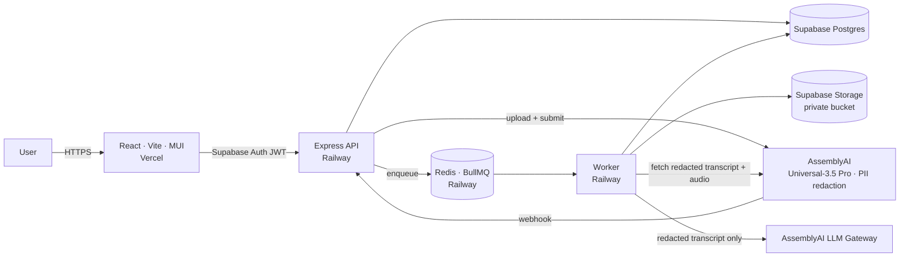
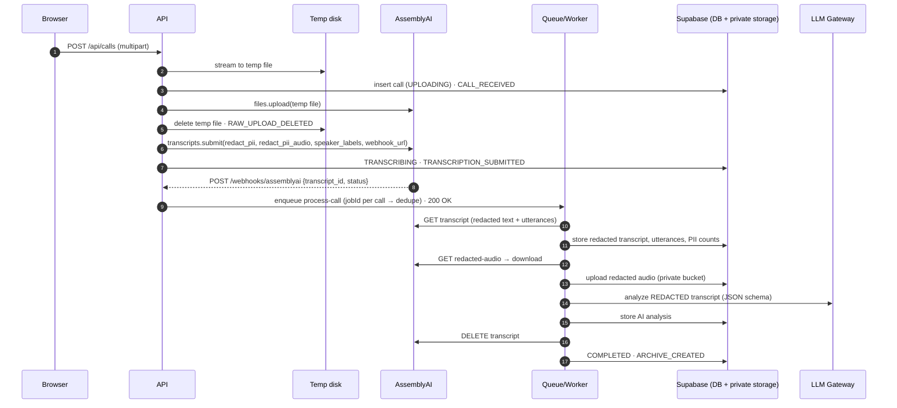

# SafeCall architecture

SafeCall turns recorded customer calls into a **safe archive**: redacted audio, a redacted and speaker-separated transcript, PII statistics, AI insights computed from the redacted text, and an audit trail. The original recording never reaches permanent storage.

## Components

| Service | Responsibility |
| --- | --- |
| **Frontend** (`frontend/`) | Supabase Auth sign-in, upload, live processing view, safe archive, search, analytics, policies, audit. Talks only to the API (never to tables or storage directly). |
| **API** (`backend/src/server.ts`) | Auth + org scoping, multipart upload to a temp file, AssemblyAI upload/submit, webhook receiver, signed URLs, search, analytics, export. |
| **Worker** (`backend/src/workers/worker.ts`) | BullMQ jobs: `process-call` (post-transcription pipeline), `poll-transcript` (local fallback), `sweep-stuck-calls` (missed-webhook safety net). |
| **Postgres** (`database/migrations/`) | `organizations`, `users`, `calls`, `call_utterances`, `audit_logs`, `pii_policy_settings`; full-text search over safe data; RLS enabled with no anon/auth policies. |
| **Storage** | Private bucket `safe-call-audio`, path `org_<org>/YYYY/MM/<call>.mp3`. |

## Data flow and the privacy boundary

Everything left of the AssemblyAI step is transient. After it, only redacted artifacts exist:

| Artifact | Where | Contains PII? |
| --- | --- | --- |
| Raw upload | OS temp dir on the API host, deleted right after `files.upload` (plus an hourly purge of stale files) | Yes — transient only |
| AssemblyAI transcript | AssemblyAI, deleted by the worker after archiving (`ASSEMBLYAI_DELETE_AFTER_ARCHIVE`) | Redacted text only (we never request `redact_pii_return_unredacted`) |
| Redacted audio | Supabase Storage, private bucket | PII replaced with silence |
| Redacted transcript + utterances | Postgres | Entity labels such as `[PHONE_NUMBER]` |
| PII statistics | Postgres (`pii_counts`, `pii_types`, `pii_total`) | Types and counts only |
| AI analysis | Postgres (`ai_summary`) | Generated from redacted text |
| Audit trail | Postgres (`audit_logs`) | IDs, stages, counts — metadata is sanitized |

### Safeguards in code

- **Request builder** (`services/assemblyai/transcription.ts`): `redact_pii: true`, `redact_pii_sub: "entity_name"`, `redact_pii_audio: true` with `override_audio_redaction_method: "silence"`, and never `redact_pii_return_unredacted`.
- **Response guard** (`toSafeTranscript`): refuses transcripts where `redact_pii !== true` and copies only safe fields (never `unredacted_*`).
- **Type-level LLM guard**: `AnalysisService.analyze()` accepts only the branded `SafeText` type, which can only be built from a verified redacted transcript or the safe archive.
- **Logs**: pino redaction paths for text, transcript, URL and credential fields; errors are summarized (name/status/message) without payloads.
- **Access**: service-role key only on the server; every query is scoped to the caller's organization; RLS denies the anon/authenticated roles; playback uses 5-minute signed URLs and each issuance is audited.

## Pipeline stages and idempotency

`processCall` (in `backend/src/pipeline/processCall.ts`) is resumable. Each stage checks whether its output already exists, and each audit event is written once per call:

1. **Transcription + speaker separation.** Language, duration, model, speaker count.
2. **PII.** Count markers, then store the redacted transcript and utterances.
3. **Audio.** Wait for the redacted audio, download it, then upload it to private storage.
4. **AI analysis.** Built from the archived redacted utterances.
5. **Cleanup and finalize.** Delete the transcript at AssemblyAI (best effort), then mark `COMPLETED`.

Duplicate webhooks collapse onto one BullMQ job ID (`process-<callId>`), and `claimForProcessing` only moves `TRANSCRIBING|PROCESSING` calls matching the transcript ID. Transient failures (network, 429, 5xx, not-ready redacted audio, invalid LLM JSON) are retried with exponential backoff. The final failure marks the call `FAILED` with a readable message. `POST /api/calls/:id/retry` resumes from the failed stage while the AssemblyAI transcript still exists.

Webhook handling follows AssemblyAI's contract. The handler authenticates the `X-SafeCall-Webhook-Secret` header (constant-time comparison), enqueues the job, and returns 2xx immediately. The payload carries only `{transcript_id, status}`, so the worker fetches the transcript itself. The separate "redacted audio ready" notification is acknowledged; the worker fetches the file itself.

When the API has no public HTTPS URL (local development), submissions omit `webhook_url`. A delayed `poll-transcript` job checks the status instead. This is a development fallback, not a long HTTP poll. In production, a 5-minute sweeper re-checks calls stuck in `TRANSCRIBING` in case every webhook delivery failed.

## PII counting

`redact_pii_sub: "entity_name"` replaces detected values with labels. AssemblyAI redacts **word by word**, so one address can arrive as `[LOCATION_ADDRESS] [LOCATION_ADDRESS], [LOCATION_ADDRESS]`. SafeCall counts a run of same-type markers separated only by spaces, commas or dashes as one entity (`countPiiMarkers`), and the UI renders the run as a single redaction bar. The raw marker count is kept in the `TRANSCRIPT_REDACTED` audit event.

## LLM analysis

LLM Gateway `POST /v1/chat/completions`, authenticated with the raw API key. The system prompt requires analyzing only the redacted transcript, never reconstructing redacted information, and never inventing facts.

- Models that support `response_format` get a strict JSON Schema.
- Models that don't (for example `qwen3.5-4b-32k-fast`) get the same schema in the prompt.

`LLM_RESPONSE_FORMAT=auto` checks `supported_parameters` from `GET /v1/models`. Output is repaired server-side (`post_processing_steps: json-repair`) and validated with zod. Required fields and enums are strict, and unknown keys are dropped.

## Search

`calls.search_vector` is a stored generated `tsvector` over the AI analysis (weight A), redacted transcript (B), department (C) and filename (D), with a GIN index. The `search_calls()` SQL function adds org-scoped filters and `ts_headline` snippets. It is callable only by the service role.
